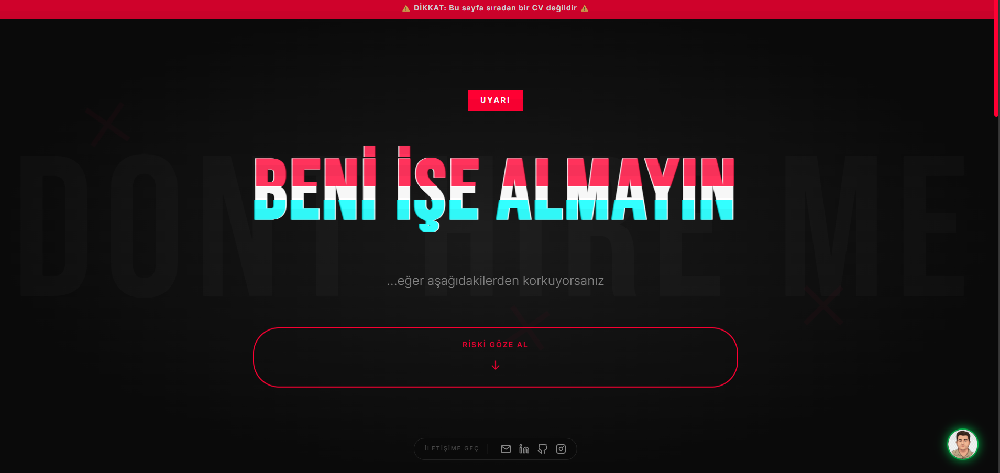
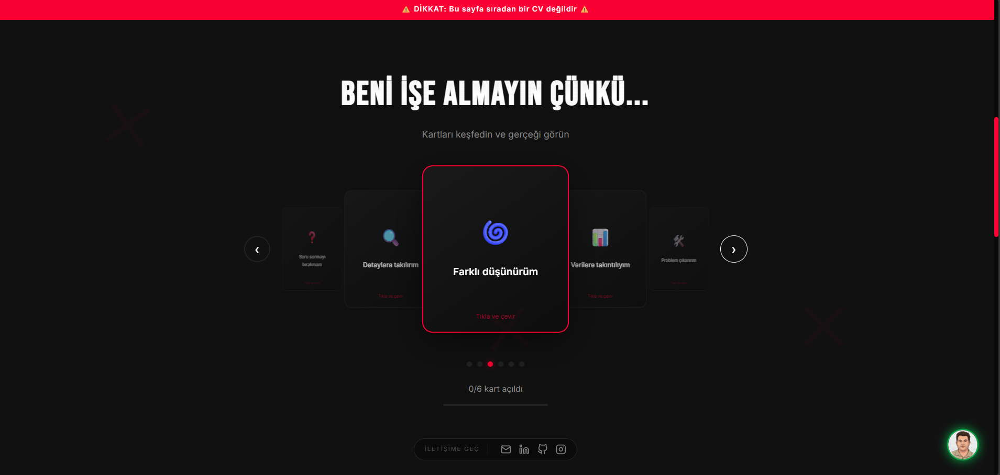
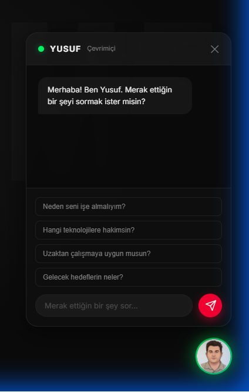

# 🚫 BENİ İŞE ALMAYIN | Don't Hire Me

> Ters psikoloji ile tasarlanmış, interaktif ve sıra dışı bir kişisel tanıtım web sitesi.


## 📖 Hakkında

Bu proje, geleneksel CV formatlarından sıkılan ve kendini farklı bir şekilde tanıtmak isteyen yazılımcılar için tasarlanmış interaktif bir web sitesidir. "Beni işe almayın" teması ile ters psikoloji kullanarak, ziyaretçilerin dikkatini çeker ve gerçek yetenekleri eğlenceli bir şekilde sunar.

## ✨ Özellikler

- 🎠 **Coverflow Kart Galerisi** - 3D perspektifli, çevrilebilir kartlar
- 🎯 **Ters Psikoloji Teması** - "Olumsuz" özellikler, çevrildiğinde gerçek yeteneklere dönüşür
- 📱 **Tam Responsive** - Mobil, tablet ve masaüstü uyumlu
- ✨ **Glitch Efektleri** - Modern ve dikkat çekici animasyonlar
- 🎉 **Confetti Efekti** - İletişime geçme kutlaması
- ⌨️ **Klavye Navigasyonu** - Ok tuşları ile gezinme
- 👆 **Touch/Swipe Desteği** - Mobilde parmakla kaydırma

## 🌐 Canlı Demo

👉 **[dont-hire-me.netlify.app](https://dont-hire-me.netlify.app/)**

## 📸 Ekran Görüntüleri

### Ana Sayfa


### Coverflow Kartları


### Dijital İkiz (AI Chatbot)


## 📁 Proje Yapısı

```
dont-hire-me/
├── index.html          # Ana HTML dosyası
├── style.css           # Tüm stiller ve animasyonlar
├── script.js           # JavaScript işlevselliği
├── avatar512-1.png     # Avatar görseli
├── netlify.toml        # Netlify yapılandırması
├── netlify/
│   └── functions/
│       └── gemini.js   # Gemini API serverless fonksiyonu
├── README.md           # Bu dosya
└── LICENSE             # MIT Lisansı
```


## 🛠️ Kullanılan Teknolojiler

- **HTML5** - Semantik yapı
- **CSS3** - Animasyonlar, Flexbox, CSS Grid, CSS Variables
- **Vanilla JavaScript** - Framework bağımsız, saf JS
- **Google Fonts** - Bebas Neue, Inter
- **Netlify Functions** - Serverless API
- **Google Gemini API** - AI chatbot

## 📝 Geliştirme Süreci

### Aşama 1: Temel Yapı
- Proje iskeleti oluşturuldu (HTML/CSS/JS)
- "Beni İşe Almayın" konsepti ve ters psikoloji teması belirlendi
- Glitch efektli başlık ve temel sayfa düzeni tasarlandı

### Aşama 2: Coverflow Kart Galerisi
- 3D perspektifli kart yapısı geliştirildi
- Kartların ön/arka yüz çevirme animasyonu eklendi
- Klavye navigasyonu (ok tuşları) ve touch/swipe desteği entegre edildi

### Aşama 3: Responsive Tasarım
- Mobil, tablet ve masaüstü için breakpoint'ler ayarlandı
- Tüm ekran boyutlarında düzgün görünüm sağlandı
- Touch cihazlar için optimizasyon yapıldı

### Aşama 4: İçerik Bölümleri
- "Kanıtlar" sekmeli yapısı oluşturuldu (Projeler/Deneyim)
- 10 proje kartı ve 7 iş deneyimi eklendi
- İletişim bölümü ve sosyal medya linkleri entegre edildi

### Aşama 5: Dijital İkiz (AI Chatbot)
- Floating chat butonu ve chat arayüzü tasarlandı
- Netlify Functions ile serverless backend oluşturuldu
- Google Gemini API entegrasyonu yapıldı
- Sistem prompt'u ile kişiselleştirilmiş AI yanıtları ayarlandı

### Aşama 6: Güvenlik & Deploy
- API key'leri environment variable'lara taşındı
- Git geçmişinden hassas bilgiler temizlendi (git filter-repo)
- Netlify'a deploy edildi
- CC BY-NC 4.0 lisansı eklendi

## 📄 Lisans

Bu proje [CC BY-NC 4.0](LICENSE) lisansı altındadır. Kişisel kullanım serbesttir, ticari satış yasaktır.

## 🤝 Katkıda Bulunma

1. Fork yapın
2. Feature branch oluşturun (`git checkout -b feature/yeni-ozellik`)
3. Değişikliklerinizi commit edin (`git commit -m 'Yeni özellik eklendi'`)
4. Branch'inizi push edin (`git push origin feature/yeni-ozellik`)
5. Pull Request açın

## 👨‍💻 Yazar

**Yusuf Gül**

[](mailto:zyusuf_16@hotmail.com)
[](https://www.linkedin.com/in/yusufgul/)
[](https://github.com/yuusufgul16)
[](https://www.instagram.com/yyusufgull/)

## 🗺️ Roadmap

- [x] Coverflow kart galerisi
- [x] Responsive tasarım
- [x] Dijital İkiz (AI chatbot)
- [ ] Çoklu dil desteği (EN/TR)
- [ ] Tema değiştirme (Dark/Light)

## ❓ Sık Sorulan Sorular

<details>
<summary><strong>Bu projeyi kendi CV'im için kullanabilir miyim?</strong></summary>

Evet! CC BY-NC 4.0 lisansı altında açık kaynak. Fork'layıp kendi bilgilerinle düzenleyebilirsin (ticari satış hariç).
</details>

<details>
<summary><strong>Dijital İkiz nasıl çalışıyor?</strong></summary>

Google Gemini API kullanarak gerçek zamanlı AI yanıtları üretir. Netlify Functions ile serverless olarak çalışır.
</details>

<details>
<summary><strong>Neden "Beni İşe Almayın" teması?</strong></summary>

Ters psikoloji! Geleneksel CV'lerden sıkılan işverenler için dikkat çekici ve akılda kalıcı bir deneyim sunuyor.
</details>

---

⭐ Bu projeyi beğendiyseniz yıldız vermeyi unutmayın!
